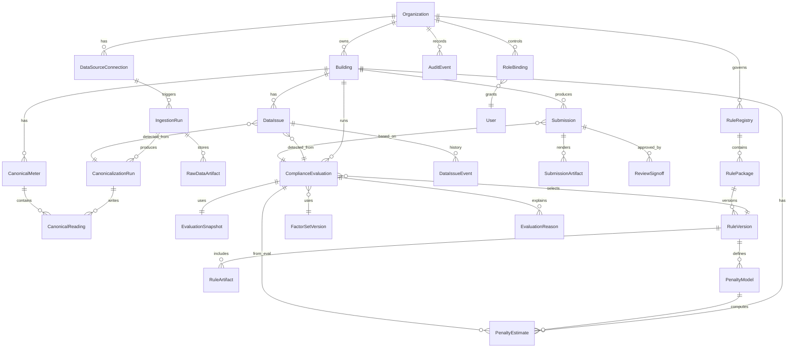
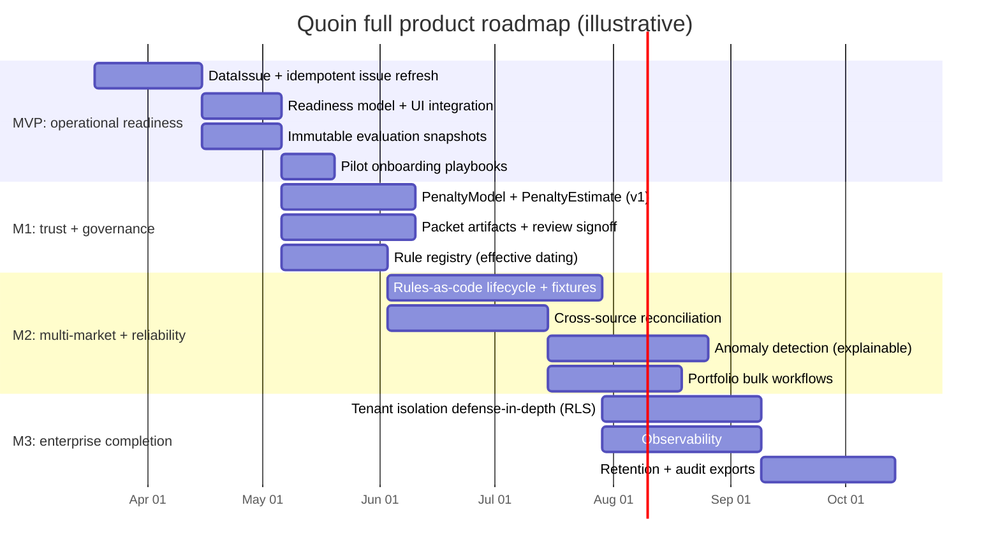

# Full Quoin Product Roadmap

## Executive summary

Quoin’s “full version” is best defined as an **enterprise-grade building compliance data system** that (a) ingests multi-source energy data, (b) normalizes it into a canonical building model, (c) proves data quality with explainable checks, (d) drives regulated workflows (benchmarking + BEPS) through a deterministic, versioned rules engine, (e) computes penalties and “what-if” deltas deterministically, and (f) produces **submission-ready packets** with an audit trail strong enough to survive third-party verification and regulator review.

The key leap from the current focused system to the full platform is **not** more integrations or more UI pages. It is the completion of three enterprise layers:

- **Canonical energy data substrate**: source reconciliation, meter mapping, provenance, backfills, and repeatable aggregates built on standards like ESPI/Green Button structures (UsagePoint/MeterReading/IntervalBlock) and Portfolio Manager schemas. citeturn5view1turn5view0turn9view4  
- **Resolution + readiness operations layer**: QA becomes persistent issues + ownership + resolution state, and readiness becomes an explicit operational model tied to submissions and filings (rather than a computed badge).  
- **Rules/versions/compliance artifacts lifecycle layer**: rules-as-code with effective dates, controlled publication, regression fixtures, and immutable “evaluation snapshots” that replay over time.

Success in pilots is measurable through operational outcomes (time saved, fewer errors, fewer escalations) and hard reliability/security gates (idempotent ingestion, audit integrity, tenant isolation). The platform should treat regulated workflows as **evidence production pipelines**, not just calculations. The BEPS workflow and penalty regime are inherently evidence and documentation driven (standard evaluation → compliance cycle if not meeting standard; alternative compliance penalties tied to gross floor area and proportional progress). citeturn8view1turn8view0turn7view0turn7view2

---

## Product vision and success criteria

### What “full version” means in operational terms

“Full Quoin” is a system that reliably takes an organization from **raw, messy energy data** to:

- **Submission-ready benchmarking artifacts** (annual cadence, validated data completeness and schema compliance)  
- **BEPS compliance outcomes** (period-based standard evaluation and cycle-based pathways) in an explainable, inspectable workflow citeturn8view1turn8view0turn5view3  
- **Deterministic penalty exposure** computed from authoritative program rules (max penalty, caps, proportional reduction factors) with scenario deltas citeturn7view0turn7view2  
- **Audit-grade traceability** across ingestion → normalization → QA → evaluation → report/packet generation, aligned with log-management best practices (integrity, centralization, retention, review). citeturn1search5turn3search1  

### KPI framework (measurable outcomes)

A rigorous KPI set should be tied to three loops: data loop, compliance loop, and enterprise loop.

**Data loop KPIs**
- **Time-to-usable-data (TTUD)**: median hours from connecting a source (Green Button or PM) to “12-month coverage validated.”  
- **Ingestion completeness rate**: % of buildings with ≥12 months complete coverage for required fuels.  
- **Reconciliation success**: % of buildings where multi-source data can be reconciled into a single canonical meter set without unresolved blocking issues.  
- **Backfill coverage**: % of expected historical interval/months successfully fetched and deduplicated.

**Compliance loop KPIs**
- **Time-to-ready**: median days from first data import to READY_TO_SUBMIT.  
- **First-pass acceptance proxy**: % of submissions generated with zero blocking QA issues.  
- **Rework rate**: mean count of post-review changes required per building packet.  
- **Determinism**: % of re-runs that produce identical outputs given identical snapshots + ruleVersion (target ~100%).

**Enterprise loop KPIs**
- **Audit completeness**: % of evaluation outputs referencing immutable snapshots + ruleVersion + factorSet + reasonCodes + user/system attribution. (This aligns to log/audit expectations for regulated workflows.) citeturn1search5turn0search11  
- **Tenant isolation incidents**: 0 across all environments; verified via automated tests and (ideally) database-level policies. citeturn3search0turn3search4  
- **Integration reliability**: sync job success %, retry stabilization (429/5xx) for Portfolio Manager. PM explicitly documents HTTP errors including 429 and 5xx responses and requires `application/xml`. citeturn9view4turn4search0turn4search1  

---

## Layered architecture and data model evolution

### Reference architecture layers

A full enterprise-grade Quoin is best approached as a layered system with strict contracts between layers.

**Source ingestion layer (existing, must harden)**
- Green Button: based on NAESB ESPI; consists of a common XML format and an exchange protocol for automated transfer with customer authorization. citeturn9view0turn5view1  
- Portfolio Manager: XML web services with Basic auth, explicit endpoints, and documented error behaviors. citeturn4search0turn9view4  
- CSV: controlled ingestion envelopes, schema validation, and provenance.

**Canonical normalization layer (must formalize)**
- Convert all sources to a canonical model (Building → Meters → Readings → Aggregates), with provenance and quality flags.
- Persist “raw payload references” (or normalized raw records) to support replay and auditing.
- Model meter mapping explicitly (source meter identifiers to canonical meters; support aggregation/submeters).

**Data quality and resolution layer (currently emerging)**
- QA verdicts become a generator of persistent issues with severity (blocking / warning).
- Issues drive readiness and workflow, not the other way around.

**Compliance execution layer (existing, must deepen)**
- Compliance engine consumes **immutable snapshots** plus ruleVersion/factorSet and produces deterministic results and reason codes.
- Separate “rule selection” from “rule logic execution” via a registry/lifecycle model.

**Penalty + scenario layer (mostly missing as a first-class system)**
- Deterministic penalty engine aligned to BEPS penalty structures: maximum penalty and proportional adjustment based on achieved progress. citeturn7view0turn7view2  
- Scenario deltas: “if nothing changes” vs “if target improvements are met,” without jumping into financing products.

**Reporting/packet layer (existing, must become authoritative)**
- Reports should be generated off persisted evaluation artifacts, snapshots, and issues/resolutions.
- Treat reports as regulated “artifacts” with versioning and signatures (human attestations and system attestations).

**Auditability and trust layer (existing, must become universal)**
- Centralized, tamper-resistant logs and audit trails are a core enterprise requirement. NIST explicitly frames security logs as critical for auditing and investigations and emphasizes log management processes enterprise-wide. citeturn1search5turn1search1  
- OWASP guidance emphasizes separation of security logging from other operational logs and protecting log integrity. citeturn3search1turn3search15  

**Multi-tenant isolation layer (must harden)**
- Keep application-level scoping, but add database-level defense-in-depth where feasible.
- PostgreSQL row-level security requires policies (`CREATE POLICY`) and table enablement. citeturn3search0turn3search4  

### Data model additions and adjustments

Below is a proposed ER model for “full Quoin.” It assumes you already have Organization, Building, User, Meter/Readings, ComplianceRun, AuditLog, Jobs, BenchmarkSubmission, BEPSFiling equivalents—this diagram focuses on what must be added/standardized.



### Key design commitments (enterprise-grade behaviors)

**Immutable evaluation snapshots**
- Store a cryptographic hash of the snapshot payload and reference it from every ComplianceEvaluation and SubmissionArtifact. This enables replay and defensibility.

**Idempotent ingestion and issue generation**
- Every ingestion run and webhook must be deduplicated and safe to retry.
- For webhook-driven ingress, align with “at least once” semantics: Svix documents that delivery may be duplicated and recommends deduplication using the stable `webhook-id` across retries. citeturn9view3  

**Controlled migration workflow**
- Use production-safe migration workflows. Prisma documents that `prisma migrate deploy` applies pending migrations for production/staging and that Prisma Migrate uses advisory locking to prevent concurrent migration commands. citeturn0search3turn0search7  

---

## Roadmap and milestones

This roadmap is structured around vertical completion: each milestone must produce end-to-end operational value for real users, not a collection of partially working modules.

### Milestone definitions

**MVP (the “operational compliance OS” baseline)**
- Complete resolution layer and readiness state across benchmarking + BEPS.
- Standardize immutable evaluation snapshots and ensure all displayed statuses are driven from persisted artifacts.

**M1 (trust + governance)**
- Penalty engine v1 (deterministic BEPS penalty exposure and delta-to-target).
- Submission packet generation upgraded to artifact-based versioning with review signoff.
- Stronger rule/version lifecycle primitives.

**M2 (multi-market and reliability hardening)**
- Rules-as-code lifecycle: rule registry, publication workflow, regression fixtures, effective dating.
- Advanced anomaly detection and cross-source reconciliation.
- Portfolio-scale workflows: batching, bulk actions, SLA dashboards (still compliance-focused, not generic BI).

**M3 (enterprise completion)**
- Tenant isolation defense-in-depth, SOC2-ready controls, operational instrumentation and incident response posture.
- Migration to “regulated system of record” behaviors: retention, legal holds, “audit export,” and event-level provenance.

### Deliverables table with acceptance criteria and risk notes

| Milestone | Deliverables | Acceptance criteria (sample) | Effort | Key risks |
|---|---|---|---|---|
| MVP | Persistent DataIssue + workflow states; readiness model; issue-driven UI; automatic issue refresh on ingestion/evaluation; snapshot hashing | 1) Any FAIL/WARN produces issues; 2) resolving data removes blocking issues deterministically; 3) readiness transitions are explainable and tied to artifacts; 4) re-run with identical snapshot yields identical result contract | Medium | “Issue churn” if detection not truly idempotent; unclear ownership model for resolution |
| M1 | PenaltyModel + PenaltyEstimate; penalty views and report sections; review signoff; rule registry metadata (effective dates, jurisdiction); report as immutable artifact | 1) Penalty computation matches published rule math: max penalty and proportional adjustment factor; 2) every packet references eval snapshot + ruleVersion; 3) signoff is auditable and role-gated | Medium–Large | Regulation nuance; ensuring penalties are computed from the same metrics and periods as the compliance evaluation |
| M2 | Rule authoring lifecycle + regression fixtures; cross-source reconciliation; anomaly detection beyond coverage checks; portfolio bulk workflows | 1) Rule updates are test-gated; 2) regression suites prevent silent changes; 3) cross-source mismatches produce explainable issues; 4) bulk actions do not break auditability | Large | Scope creep (“platform BI”); data science complexity; customer-specific corner cases |
| M3 | RLS defense-in-depth; enterprise observability and SLOs; security posture: secrets, encryption, retention policies; audit exports | 1) Tenant isolation tested and enforced; 2) production monitoring for ingestion lag, job failures, and evaluation drift; 3) retention and export meet pilot contract requirements | Large | Operational maturity and security review overhead; internal tooling investment |

### Timeline chart

The timeline below assumes a “standard” team and sequencing. Team-size options are detailed in the final section.



---

## Integration contracts and API specifications

This section defines the integration behaviors Quoin must guarantee to be enterprise-grade. It focuses on **contracts, idempotency, retries, and auth**, not UI.

### Green Button ingestion contract (Connect My Data / ESPI)

Green Button is rooted in NAESB ESPI with both (a) a common XML format and (b) an exchange protocol enabling automated transfer based on customer authorization. citeturn9view0turn5view1  
The OpenESPI documentation describes the model as Atom feeds containing resources such as UsagePoint and MeterReading, with relationships expressed via `<link>` tags inside Atom entries. citeturn5view0turn5view1  

**External-facing contract (Quoin as Third Party receiver)**
- **Authorization**: OAuth 2.0 authorization code grant with PKCE is the modern baseline for public clients; RFC 6749 defines authorization code flow and RFC 7636 defines PKCE to mitigate interception attacks. citeturn3search2turn3search3  
- **Ingestion events**: notifications of new data should enqueue asynchronous ingestion runs (do not parse synchronously in HTTP handler).
- **Idempotency**: provider notifications must be deduped using a stable event id if provided; otherwise compute a content hash (payload + subscription id + timestamp) and store in an event-dedup table.

**Internal Quoin API surface (recommended)**
- `POST /api/green-button/authorize` → start OAuth handshake; record state + intended building/org binding.
- `GET /api/green-button/callback` → exchange code; store encrypted tokens; schedule initial backfill ingest.
- `POST /api/green-button/webhook` → receive notifications; ack quickly; schedule fetch-and-canonicalize job.

**Retry semantics**
- Handle network errors with exponential backoff and bounded retries.
- Token refresh failures should transition the connection into `NEEDS_REAUTH` and generate a blocking DataIssue for the building portfolio.

### Portfolio Manager integration contract

Portfolio Manager web services are organized into categories (account, connection/sharing, property, meter, reporting, etc.). citeturn5view2turn4search7  
Endpoints explicitly use **Authorization: Basic** and return XML. The docs also list common HTTP errors and confirm that only `application/xml` is supported and that 429 indicates rate limit exceeded. citeturn4search0turn9view4  

**External dependency behavior**
- **Authentication**: Basic credentials per EPA documentation (providers must safeguard secrets).
- **Schema compliance**: invalid XML yields application-level errors; PM explicitly indicates schema validation errors (-100) can occur (per their error codes page). citeturn9view4  
- **Rate limits**: PM documents 429 and 5xx/maintenance responses; clients must backoff and retry safely. citeturn9view4turn4search10  

**Suggested Quoin integration behaviors**
- A “sync coordinator” that schedules:
  - incremental “what changed since” pulls (when available) to reduce full scans
  - property/meter list refresh
  - meter readings pull/push (as needed)

**Internal API surface (recommended)**
- `POST /trpc/benchmarking.syncFromPortfolioManager` → enqueue sync job; return job id + last sync status.
- `POST /trpc/benchmarking.pushToPortfolioManager` → push validated monthly totals or meter updates (where supported by your product).
- `GET /trpc/benchmarking.syncStatus` → job state, errors, next retry time.

**Retry semantics**
- On 429: respect `Retry-After` if present (general HTTP guidance), otherwise apply exponential backoff with jitter and a ceiling. citeturn4search10turn9view4  
- On 500/502: retry with backoff; mark as transient errors; create warning DataIssues if persistent.

### CSV upload contract

CSV is a high-value operational entry point: it often represents “the data someone actually has” when integrations fail.

**Contract goals**
- Deterministic parsing (versioned parser), clear validation errors, and provenance.
- Every accepted upload produces an IngestionRun and CanonicalizationRun record so it is auditable.

**Internal API surface (recommended)**
- `POST /api/upload` (multipart form) with:
  - `buildingId`
  - `source=CSV`
  - `file`
  - optional `schemaVersion`
- Response must include:
  - ingestionRunId
  - numbers of records accepted/rejected
  - blocking issues created

### Clerk organization/user sync contract

Clerk documents webhook verification via Svix signatures and recommends additional protection like limiting inbound traffic to Svix webhook IP ranges. citeturn9view1  
Svix explicitly notes signature validation requires the **raw request body** and that even minor transformations can break verification. citeturn9view2  
Svix also documents “at least once” semantics and provides a stable `webhook-id` for deduplication across retries. citeturn9view3  

**Contract requirements**
- Verify signature using raw body.
- Deduplicate with `webhook-id` (store processed ids with TTL and/or persistent table).
- Webhook handler must be fast: enqueue downstream processing and return 2xx.

**Internal API surface (recommended)**
- `POST /api/webhooks/clerk` → verifies Svix headers + payload; writes org/user updates; creates AuditEvent.

---

## Operations, security, testing, and deployment

### Data operations and SRE requirements

**Backfills and replay**
- On new connection: backfill at least 24 months where available, then move to incremental sync.
- Store enough raw/provenance to replay transformations when:
  - rules change
  - normalization logic changes
  - a customer disputes a computed result

**Idempotency guarantees**
- IngestionRun should be safe to retry:
  - deduplicate raw artifacts by (source, externalId, timeRange, checksum)
  - deduplicate canonical readings by (canonicalMeterId, intervalStart, intervalEnd, unit, source)
- Webhook ingress must be deduped similarly; Svix provides direct guidance via `webhook-id`. citeturn9view3  

**Monitoring (minimum viable enterprise posture)**
- SLIs:
  - ingestion lag (time since last successful data pull per building)
  - job failure rate (per integration type)
  - evaluation failure rate and blocked evaluations
- Alerts:
  - sustained lag > threshold for high-priority buildings
  - repeated 429/5xx spikes when syncing Portfolio Manager
  - sudden regression in data completeness across portfolio

**Audit and log management**
- NIST frames log management as enterprise practice with auditing and investigative uses; treat Quoin audit logs as non-optional production infrastructure. citeturn1search5turn1search1  
- OWASP guidance emphasizes protecting log integrity and centralizing logs to prevent loss/tampering. citeturn3search1turn3search15  

### Security, compliance, and privacy checklist

**Secrets and tokens**
- OAuth tokens and PM credentials must be protected at rest and in transit. OAuth is an authorization framework with well-defined flows; using authorization code flow + PKCE reduces code interception risk. citeturn3search2turn3search3  
- Webhooks:
  - verify Svix signatures and timestamps; use raw body (per Svix docs) citeturn9view2  
  - restrict inbound to Svix IPs where feasible (per Clerk guidance) citeturn9view1  

**Tenant isolation**
- Defense-in-depth recommendation: add PostgreSQL row-level security policies for critical tables (Organization, Building, CanonicalReading, ComplianceEvaluation, SubmissionArtifact) where operationally feasible. PostgreSQL requires enabling RLS and defining policies via `CREATE POLICY`. citeturn3search0turn3search4  

**Audit retention and integrity**
- Define retention windows that match regulatory and customer needs (often multi-year).
- Protect audit logs from modification; consider append-only storage patterns for audit exports.

### Testing strategy and pilot validation

**Testing layers**
- Unit tests:
  - rule selection logic (effective dating)
  - penalty engine math (golden fixtures from published examples)
  - idempotent issue generation (same inputs → no churn)
- Integration tests:
  - ingestion → canonicalization → QA → evaluation → packet pipeline with a real DB
  - webhook verification and dedup behavior (Svix headers, raw body handling) citeturn9view2turn9view3  
- Data regression tests:
  - “golden building datasets” that lock expected outputs across versions (snapshot hash + ruleVersion).
- Property-based tests (high leverage):
  - time series invariants (no negative usage, no overlapping intervals post-normalization, monotonic timestamps)
  - dedup invariants (replaying same import N times yields one canonical dataset)

**Pilot validation plan (task-based)**
- Pilot tasks should mimic real consultant/operator workflows:
  - connect Green Button or PM
  - resolve blocking issues to reach READY_TO_SUBMIT
  - generate packet
  - compare packet completeness vs their prior manual process
- Success metrics:
  - reduction in time spent reconciling data (self-reported + system time telemetry)
  - number of “unknowns” requiring manual spreadsheet work
  - number of times outputs must be regenerated pre-submission
- Evidence capture:
  - record user actions as audit events
  - record which issues blocked submission and how they were resolved

### Migration and deployment plan

**Schema evolution**
- Use additive migrations first (new tables, new columns nullable).
- Backfill in controlled jobs (idempotent) rather than in migration SQL when the data volume is non-trivial.

**Safe rollout mechanics**
- Feature flags:
  - issue-based readiness (on/off per org)
  - penalty engine results (shadow mode first)
- Canary:
  - enable new workflow for one pilot org, then expand

**Operational migration tooling**
- In production/staging, use `prisma migrate deploy` as Prisma documents; understand advisory locking behavior to avoid parallel deployment races. citeturn0search3turn0search7  

---

## Team, resourcing options, risks, and the next 90 days

### Team and resourcing model

Because team size, budget, and timeline are unspecified, here are three realistic options. The milestones stay the same; the timelines shift.

**Lean team (3–5 people)**
- Roles: 1 staff/full-stack lead, 1 backend/data engineer, 1 frontend engineer, 0.5 product, 0.5 domain/regulatory advisor.
- Expected pace: MVP in ~8–12 weeks; M1 in ~12–20 weeks; M2/M3 require careful scope discipline.

**Standard team (6–10 people)**
- Roles: staff eng/architect, 2 backend, 1 data engineer, 1–2 frontend, 1 QA/automation, 1 PM, 1 domain advisor (fractional), plus DevOps/SRE fractional.
- Expected pace: MVP in ~6–8 weeks; M1 in ~8–12 weeks; M2 in ~12–16 weeks; M3 in ~16–24 weeks.

**Aggressive enterprise push (11–20 people)**
- Adds: dedicated SRE, security engineer, more domain expertise, dedicated integration engineer, and technical writer/compliance ops.
- Expected pace: parallelize M1/M2 but requires strong architecture governance to avoid “platform sprawl.”

### Risks and open questions

**Regulatory correctness risk**
- Rule edge cases and documentation requirements evolve; your rule lifecycle must support controlled updates and regression protection.
- BEPS rules include pathway complexity and enforcement/penalty details; penalty computation must align to published examples (max penalty + proportional adjustment). citeturn7view0turn7view2  

**Integration reliability risk**
- Portfolio Manager rate limits and downtime (429/5xx) require robust retry/backoff and operational monitoring. citeturn9view4turn4search10  

**Data quality “trust gap” risk**
- If anomaly detection and reconciliation aren’t explainable, users will not trust outputs even if they are correct.

**Enterprise security posture risk**
- Webhook verification and dedup must be correct; Svix emphasizes raw-body verification and provides dedup primitives. citeturn9view2turn9view3  
- Tenant isolation should be proven, ideally with defense-in-depth via RLS. citeturn3search0turn3search4  

### Recommended next 90-day plan

This is the highest-leverage 90-day plan that advances toward the full platform without drifting into financing or generic dashboards.

**Days 1–30: Finish operational readiness**
- DataIssue model + idempotent refresh loop across ingestion/evaluation.
- Readiness state computed from issues + evaluation artifacts.
- Immutable evaluation snapshots everywhere (hash + stored payload).
- UI: issue-first building workflow (what’s wrong → what to do → ready status).

**Days 31–60: Penalty engine and artifact governance**
- PenaltyModel + PenaltyEstimate (BEPS v1), grounded in published penalty structure (max penalty and proportional adjustment examples). citeturn7view0turn7view2  
- Reports/packets become versioned SubmissionArtifacts referencing snapshot hash + ruleVersion.

**Days 61–90: Rules lifecycle + reliability hardening**
- RuleRegistry with effective-dated rule versions and regression fixtures.
- Integration reliability upgrades: PM rate-limit handling, durable job retries, monitoring.
- Pilot playbooks: onboarding checklist, data resolution SOPs, submission SOPs.

### Repo audit priorities

To validate and guide implementation sequencing, these are the highest-priority files to audit first (paths assume `full-product` branch). Links are provided as plain URLs in a code block to comply with formatting constraints.

```text
https://github.com/kavinnotetaker-svg/Quoin/blob/full-product/prisma/schema.prisma
https://github.com/kavinnotetaker-svg/Quoin/blob/full-product/src/server/compliance/compliance-engine.ts
https://github.com/kavinnotetaker-svg/Quoin/blob/full-product/src/server/compliance/benchmarking-core.ts
https://github.com/kavinnotetaker-svg/Quoin/blob/full-product/src/server/trpc/routers/building.ts
https://github.com/kavinnotetaker-svg/Quoin/blob/full-product/src/server/trpc/routers/benchmarking.ts
https://github.com/kavinnotetaker-svg/Quoin/blob/full-product/src/server/trpc/routers/beps.ts
https://github.com/kavinnotetaker-svg/Quoin/blob/full-product/src/server/integrations/espm/client.ts
https://github.com/kavinnotetaker-svg/Quoin/blob/full-product/src/app/api/green-button/authorize/route.ts
https://github.com/kavinnotetaker-svg/Quoin/blob/full-product/src/app/api/green-button/callback/route.ts
https://github.com/kavinnotetaker-svg/Quoin/blob/full-product/src/app/api/green-button/webhook/route.ts
https://github.com/kavinnotetaker-svg/Quoin/blob/full-product/src/app/api/upload/route.ts
https://github.com/kavinnotetaker-svg/Quoin/blob/full-product/src/app/api/webhooks/clerk/route.ts
https://github.com/kavinnotetaker-svg/Quoin/blob/full-product/src/components/dashboard/compliance-queue.tsx
https://github.com/kavinnotetaker-svg/Quoin/blob/full-product/src/components/building/compliance-overview-tab.tsx
```

**Audit order recommendation**
- Start with persistence contracts (schema), then engine contracts (compliance-engine), then routers feeding UI, then the integration clients/routes.
- Confirm that every user-facing status is derived from persisted artifacts and snapshots, not recomputed UI logic.
- Confirm that integration endpoints implement idempotency and retry-safe behavior, especially for webhook-driven flows (raw body signature verification, dedup). citeturn9view2turn9view3